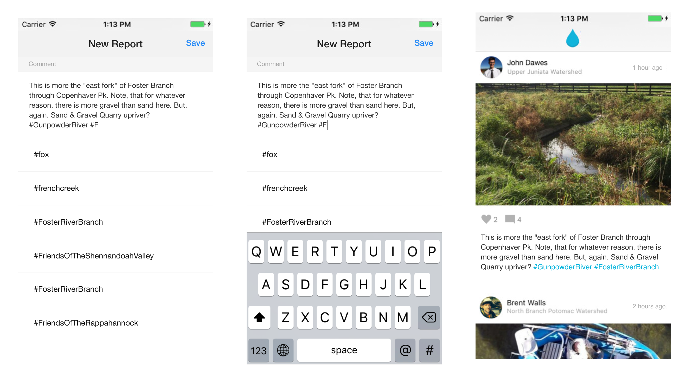
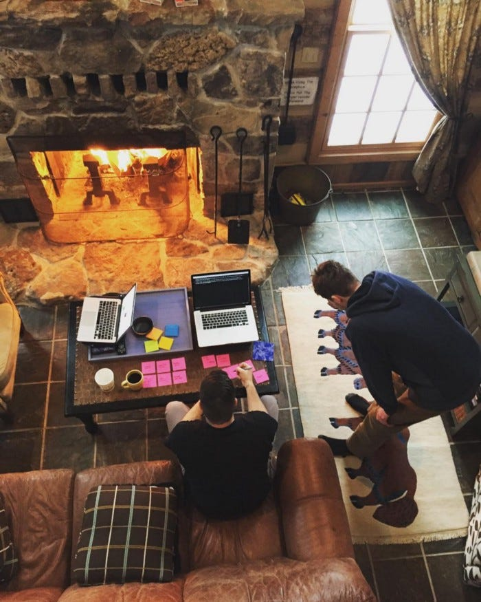

# Scaling Categorization for Citizen Science Data Collection

How I helped a team scale their categorization using design thinking, cross-functional collaboration, and applied research.

> 🎯 Water Reporter saw a 300% increase in reports during the same period the previous year after introducing hashtags, user accounts, and publicizing these features through in-person workshops.

## Overview
The [Water Reporter app was launched in 2013](https://medium.com/@joshuaisaacpowell/launching-the-water-reporter-app-92365be4ffa4) to serve a single organization, the Potomac Riverkeepers, in order to help their team better manage and respond to their organizations’ pollution reports. From 2012–2017, I performed generative research and used those insights and discoveries to drive visual design, establish data infrastructure, and create follow-on applications that enabled the team to scale to 184 organizations and over 8,500 active users.

## Problem
The Water Reporter app required users to assign a category to a report in order to submit it. This was a carry over feature from the original app architecture and requirements. The organization staff teams would then use that category to identify which program was responsible for responding to and remediating the reported issue.

The app was originally used by their team of 12 volunteers and staff who collected a few reports per month. At that time, having a group of advanced users selecting from a list of 23 categories that they were intimately familiar with was easy and fit their use case. However, the app quickly grew to support over a dozen different organizations, each group with their own categories, projects, and initiatives that they wanted to add to the now growing list of categories.

### A few problems existed.
- Each new organization joining the platform wanted to add their own initiatives and programs to the categories list
- Few organizations were willing to give up their categories and the list was growing quickly
- Categories would continue to be added for each new organization that was on-boarded

We seemed to be facing an ever growing list of questions and concerns.

- How long is too long for a single drop down list?
- How much time is it taking a user to pick a category?
- How do I know which category belongs to my organization?
- Who would manage this large and growing list?
- When would users decide to skip submitting because of category confusion?
- How would the app team manage near duplicates and changes over time?

## Research
As the UX team lead, I began untangling this issue at my desk, reviewing the existing categories, and cross referencing those with keywords I started affinitizing from the “body” of the pollution report text. Questions started to pile up more quickly than answers:

1. How many categories do we have slotted to add over the coming months?
2. What did our growth look like in the coming year or two years?
3. How might we reorganize these categories to be more readable?
4. What user interface patterns could help us solve these issues?
5. How are we going to solve this problem so that we won’t have to solve it again in the future?

I scheduled a follow up meeting with the project team clarifying the needs and where we saw this going longer term. With the information collected from that meeting, my UX team and I derived a series of “How might we…” questions or “statement starters” to help focus the project team on the real problem we were trying to solve.

- *How might we* create and share categories “organically”?
- *How might we* reduce the effort it takes to maintain categories?
- *How might we* minimize the cognitive load of selecting categories?

My UX team and I used these questions to plan an in-person design thinking workshop with the goal of clarifying our “How might we…” questions in order to make actionable recommendations.

### “How might we…” Questions
We started the workshop with an open discussion about the proposed “How might we…” questions, I facilitated the workshop by capturing ideas, concerns, small sketches, and clarifying questions on sticky notes. After we completed this initial exercise, I spent some time affinitizing these notes, and then brought the team back together.

### Iterative Storyboarding
The next portion was facilitated by another UX team member. We sketched iterative storyboard concepts based on the groups of ideas, concerns, and questions we had from the previous exercise. We got everyone involved in this, even the Water Reporter organization’s executive director and software engineer.

## Outcomes
We quickly began to realize that many of the ideas we were developing had varying issues:

1. __Type-ahead or Autocomplete__ was one option but didn’t shorten the list and required even more cognitive load than the previous drop down list with numerous results. How would the user know what to begin typing without context?
2. __Drop Down Grouping__ would provide us with “Organization” group names and list organization-specific categories below that group heading. How would the organization manage this list? How much overhead would this place on them? Were organizations going to take on the responsibility of managing this list?
3. __Organization Specific Drop Down__ driven by the organization the user was associated with was another option but would limit the “community” aspect and would add the same overhead requirements that the “Drop Down Grouping” solution did.

Finally, we took a step back and made some concrete decisions as a team.

1. The organization wasn’t going to manage their own categories
2. The Water Reporter product team wasn’t going to manage all those categories either

Which led us to the question “How could we eliminate categories all together while maintaining structured category data?”.

## Our AHA! Moment
Hashtags. Yeah, I know “hashtags” aren’t revolutionary. Hashtags are pretty common practice. Simple as they may seem, hashtags were the answer we were looking for.

- Hashtags would let the user freely “categorize” their reports
- Hashtags would reduce the number of fields on our form, no more need for a category and subcategory drop down
- Hashtags can take advantage of the first idea from above, autocomplete, and help our users find and reuse categories

Hashtags also had a few other intrinsic benefits

- __Organizations could “promote” specific hashtags__ for a project, program, initiative, or heck, even a one-day event.
- __User acceptance of the new feature was nearly instant__, most people in 2015 understood the concept of hashtags and how to use them, so there was minimal push back from our user base. In fact, most of the responses during usability testing were in the realm of “Why didn’t you add hashtags sooner?” and “Wait, the app didn’t always have hashtags?”
- __Structured data was still possible__ because we could programmatically create and relate hashtags records to report records and super-power our search.

## Conclusion
The design thinking workshop covered 2 ½ days and resulted in the addition of several new features to the Water Reporter app. Hashtags, user accounts, and a stand alone application focused on remediation efforts stemming from reports submitted through the app were among the additions.

I led the design, implementation, and usability testing of these new features to both mobile apps and the community web application. __Water Reporter saw a 300% increase* of new reports submitted after introducing hashtags, user accounts, and publicizing these features through in-person workshops.__

---

This post is part of the Water Reporter series published by Joshua Powell to share the research and engineering work he’s completed over the course of his career. 

Joshua helped launch the first version of WaterReporter on ArcGIS in 2013. Later he helped grow WaterReporter from a single organization app into platform for over 200 organizations and 8,500 environmental non-profit staff and volunteers. His work on the platform includes the design and build of the REST API infrastructure, mobile applications, as well as the Community Website and Manager operations tools. 

You can read more stories, like this one, by [visiting his website](https://joshuapowell.io).